# AntyFlow: полная архитектура материаловедческого оркестратора с обратными связями

**Версия:** 1.0  
**Статус:** целевая архитектура  
**Профиль:** `materials_rnd`  
**Граница автоматизации:** цифровой пакет эксперимента для утверждения инженером

## Что зафиксировано этой схемой

AntyFlow принимает инженерную цель, превращает её в проверяемый план, собирает доказательства, динамически назначает специализированных агентов, вызывает строгие расчётные инструменты, сравнивает сочетания состава и маршрута, формирует минимальный план экспериментов и собирает единый пакет документов.

Система **не управляет физическим оборудованием**. Статус «утверждено к эксперименту» может присвоить только инженер. Если эксперимент затем выполняется вручную, его результаты можно импортировать обратно как новую версию данных.

Схема показывает целевое устройство системы. Часть универсального оркестратора, Flow-доска, SQLite, локальный PDF-поиск, Vault и генераторы артефактов уже существуют, но материаловедческие контракты, полный Knowledge & Memory Plane, динамические AgentSpec, два обязательных human gate и большинство научных сервисов ещё предстоит реализовать.

## Как читать схему

- Идентификаторы `H`, `C`, `A`, `K`, `S`, `Q`, `O`, `X`, `F` совпадают со справочником.
- `T01…T63` — прямые переходы данных или управления.
- `F01…F24` — обратная связь, исправление, инвалидация или эскалация.
- Сплошная стрелка `-->` — обычная передача результата.
- Двунаправленная стрелка `<-->` — запрос и ответ через один контролируемый интерфейс.
- Толстая стрелка `==>` — необратимый или человеческий шлюз: запуск, утверждение, публикация.
- Пунктирная стрелка `-.->` — обратная связь; она не меняет опубликованную историю молча.

Подробное объяснение каждого блока и перехода находится в файле [02-blocks-and-transitions-guide.md](./02-blocks-and-transitions-guide.md).

## Полная блок-схема

```mermaid
flowchart TB

    subgraph humanLayer["0. Инженер, интерфейс и границы ответственности"]
        h01["H01 Инженер или исследователь"]
        h02["H02 Доска Flow и интерфейс проекта"]
        h03["H03 Диалог уточнений"]
        h04{"H04 Human Gate 1: утвердить план?"}
        h05{"H05 Human Gate 2: утвердить пакет?"}
    end

    subgraph controlLayer["1. Управляющий контур оркестратора"]
        c01["C01 Нормализатор запроса"]
        c02[("C02 ResearchGoal, версия N")]
        c03["C03 LLM-планировщик исследования"]
        c04["C04 Компилятор типизированного графа"]
        c05[("C05 Реестр NodeSpec, AgentSpec и ToolSpec")]
        c06{"C06 Граф, контракты, стоимость, время и риск корректны?"}
        c07["C07 Оркестратор политик"]
        c08["C08 Шедулер, runtime и контрольные точки"]
        c09["C09 Маршрутизатор моделей и бюджета"]
        c10["C10 Подбор и жизненный цикл агентов"]
        c11["C11 Шлюз инструментов и разрешений"]
        c12["C12 Локальный перепланировщик и менеджер изменений"]
    end

    subgraph agentLayer["2. Динамический агентный контур"]
        a01["A01 Требования и архитектура исследования"]
        a02["A02 Доказательства, данные и знания"]
        a03["A03 Проектирование составов и маршрутов"]
        a04["A04 Фазы, микроструктура, свойства и неопределённость"]
        a05["A05 DoE, стоимость, риск и Парето"]
        a06["A06 Независимая критика и техническая редактура"]
    end

    subgraph knowledgeLayer["3. Knowledge and Memory Plane"]
        k01["K01 Приём источников и неизменяемые оригиналы"]
        k02[("K02 Hybrid RAG: FTS, BM25, embeddings, RRF, reranker")]
        k03[("K03 Структурированное хранилище материалов и чисел")]
        k04[("K04 KAG-lite Evidence Graph")]
        k05[("K05 Память решений, запусков и версий")]
        k06["K06 Маршрутизатор поиска знаний"]
        k07["K07 ContextBundle со ссылками и ограничениями"]
        k08["K08 Очередь предложений"]
        k09{"K09 Provenance и Evidence Commit Gate"}
        k10["K10 Версионированный committer"]
        k11["K11 Граф зависимостей и инвалидизация"]
    end

    subgraph serviceLayer["4. Строгие модели, инструменты и внешние сервисы"]
        s01["S01 Поиск литературы, PDF, OCR и таблицы"]
        s02["S02 Единицы, стандарты и доменные правила"]
        s03["S03 Термодинамика и фазовые расчёты"]
        s04["S04 Маршрут, процесс, микроструктура и дефекты"]
        s05["S05 ML-прогнозы и model cards"]
        s06["S06 OR-Tools, DoE, стоимость и Парето"]
        s07["S07 Генераторы доски и документов"]
        s08["S08 LLM-провайдеры: Qwen и сильная модель"]
    end

    subgraph qualityLayer["5. Проверка и синтез научного результата"]
        q01{"Q01 AgentResult соответствует контракту?"}
        q02{"Q02 Научная критика и финальная проверка пройдены?"}
        o01["O01 Ранжированные кандидаты и фронт Парето"]
        o02["O02 ExperimentPackageV1"]
        o03["O03 ArtifactManifest"]
        o04["O04 Доска, MD, XLSX, DOCX, PDF и PPTX"]
        o05[("O05 Утверждённый неизменяемый пакет")]
    end

    subgraph externalLayer["6. Ручной экспериментальный цикл вне AntyFlow"]
        x01["X01 Физический эксперимент выполняется вручную"]
        x02["X02 Импорт и проверка фактических результатов"]
        x03["X03 Сравнение прогноза с фактом и active learning"]
    end

    subgraph feedbackLayer["7. Единый контролируемый контур обратной связи"]
        f01["F-HUB Сбор сигнала обратной связи"]
        f02{"F-CLASS Причина и масштаб изменения"}
        f03["F-REQ Уточнить требования"]
        f04["F-RETRY Повторить только один узел"]
        f05["F-REPLAN Перепланировать затронутую ветвь"]
        f06["F-HUMAN Эскалация инженеру"]
        f07[("F-LOG Журнал причин, правок и решений")]
    end

    h01 -->|"T01 Запрос, ограничения и приоритеты"| h02
    h02 -->|"T02 Черновик проекта"| c01
    h02 -->|"T03 Исходные файлы"| k01
    c01 -->|"T04 Черновик требований"| a01
    c01 -->|"T05 Формальная версия"| c02
    c02 -->|"T06 ResearchGoal"| c03
    c03 -->|"T07 PlanDraft"| c04
    c04 <-->|"T08 Контракты и допустимые типы"| c05
    c04 -->|"T09 Типизированный граф"| c06
    c06 -->|"T10 Граф, цена, время и риски"| h04
    h04 ==>|"T11 Разрешение на запуск"| c07
    c07 -->|"T12 Утверждённый граф и политики"| c08
    c08 -->|"T13 CapabilityRequest"| c10
    c10 <-->|"T14 AgentSpec и ToolSpec"| c05
    c10 <-->|"T15 Модель, бюджет и лимиты"| c09
    c09 <-->|"T16 Инференс"| s08

    c10 <-->|"T17 Требования и архитектура"| a01
    c10 <-->|"T18 Доказательства и данные"| a02
    c10 <-->|"T19 Составы и маршруты"| a03
    c10 <-->|"T20 Фазы, структура, свойства и UQ"| a04
    c10 <-->|"T21 DoE, стоимость и Парето"| a05
    c10 <-->|"T22 Критика и редактура"| a06

    c10 -->|"T23 Запрос контекста"| k06
    k06 <-->|"T24 Текстовый поиск"| k02
    k06 <-->|"T25 Численные запросы"| k03
    k06 <-->|"T26 Связи и multi-hop"| k04
    k06 <-->|"T27 История и решения"| k05
    k06 -->|"T28 Собранные свидетельства"| k07
    k07 -->|"T29 Scoped ContextBundle"| c10

    c10 <-->|"T30 Разрешённые вызовы"| c11
    c11 <-->|"T31 Литература и PDF"| s01
    c11 <-->|"T32 Единицы и правила"| s02
    c11 <-->|"T33 Фазы"| s03
    c11 <-->|"T34 Процесс и структура"| s04
    c11 <-->|"T35 ML-прогноз"| s05
    c11 <-->|"T36 Оптимизация"| s06
    c11 <-->|"T37 Артефакты"| s07

    c10 -->|"T38 Typed AgentResult"| q01
    q01 -->|"T39 Claim и Decision proposals"| k08
    q01 -->|"T40 Проверенные результаты"| q02
    q02 -->|"T41 Принятые кандидаты"| o01
    o01 -->|"T42 Парето, DoE и риски"| o02
    o02 -->|"T43 Задание на артефакты"| c11
    o02 -->|"T44 Состав пакета и версии"| o03
    o03 -->|"T45 Созданные представления"| o04
    o04 -->|"T46 Пакет для проверки"| h05
    h05 ==>|"T47 Утверждено к эксперименту"| o05

    o05 ==>|"T48 Ручная передача, без управления"| x01
    x01 -->|"T49 Файлы измерений и наблюдения"| x02
    x02 -->|"T50 Проверенный ручной импорт"| k01
    x02 -->|"T51 Факт и исходный прогноз"| x03
    x03 -->|"T52 Предложение калибровки"| k08

    s01 -->|"T53 Найденные источники"| k01
    k01 -->|"T54 Версионированный поисковый снимок"| k02
    k01 -->|"T55 Извлечённые предложения"| k08
    k08 -->|"T56 Кандидаты публикации"| k09
    k09 ==>|"T57 Доказательство прошло"| k10
    k10 -->|"T58 Проверенные численные записи"| k03
    k10 -->|"T59 Решения, события и версии"| k05
    k03 -->|"T60 Производная графовая проекция"| k04
    k10 -->|"T61 Событие изменения зависимости"| k11
    o05 -->|"T62 Решение инженера"| k08
    f07 -->|"T63 Аудит запуска"| k05

    a01 -.->|"F01 Недостающие требования"| h03
    h03 -.->|"F02 Вопросы инженеру"| h01
    h01 -.->|"F03 Ответы и правки"| h03
    h03 -.->|"F04 Новая версия входа"| c01

    c06 -.->|"F05 Ошибка графа или оценки"| f01
    h04 -.->|"F06 Правки предпросмотра"| f01
    c08 -.->|"F07 Сбой, таймаут или бюджет"| f01
    q01 -.->|"F08 Ошибка контракта"| f01
    q02 -.->|"F09 Научное замечание или пробел"| f01
    k09 -.->|"F10 Недостаточно происхождения"| f01
    k11 -.->|"F11 Устарели зависимости"| f01
    h05 -.->|"F12 Адресные правки пакета"| f01
    c10 -.->|"F13 Предложение нового подузла"| f01

    f01 -->|"F14 Сигнал для классификации"| f02
    f01 -->|"F15 Неизменяемая запись причины"| f07
    f02 -->|"F16 Неполные требования"| f03
    f03 -->|"F17 Вернуть в диалог"| h03
    f02 -->|"F18 Локальная техническая ошибка"| f04
    f04 -->|"F19 Повтор с лимитом"| c08
    f02 -->|"F20 Изменились данные или план"| f05
    f05 -->|"F21 Запрос изменения ветви"| c12
    f02 -->|"F22 Нужны полномочия человека"| f06
    f06 -->|"F23 Повторный human gate"| h04
    c12 -->|"F24 GraphVersion N плюс один"| c04

    classDef human fill:#FFF4CC,stroke:#9A6700,color:#2B1D00
    classDef control fill:#E8F1FF,stroke:#2457A7,color:#102A43
    classDef agent fill:#F2E8FF,stroke:#6F42C1,color:#2E1A47
    classDef knowledge fill:#E8F7EE,stroke:#26734D,color:#113D2B
    classDef service fill:#FFF0E6,stroke:#B45309,color:#4A2500
    classDef quality fill:#E9F5F8,stroke:#0E7490,color:#083344
    classDef external fill:#F4F4F5,stroke:#52525B,color:#18181B
    classDef feedback fill:#FDECEC,stroke:#B42318,color:#5F0F0F
    classDef store fill:#F4F4F5,stroke:#52525B,color:#18181B

    class h01,h02,h03,h04,h05 human
    class c01,c03,c04,c06,c07,c08,c09,c10,c11,c12 control
    class c02,c05 store
    class a01,a02,a03,a04,a05,a06 agent
    class k01,k06,k07,k08,k09,k10,k11 knowledge
    class k02,k03,k04,k05 store
    class s01,s02,s03,s04,s05,s06,s07,s08 service
    class q01,q02,o01,o02,o03,o04,o05 quality
    class x01,x02,x03 external
    class f01,f02,f03,f04,f05,f06 feedback
    class f07 store
```

## Главные архитектурные правила

1. **LLM предлагает, но не публикует истину.** Агент выдаёт типизированный результат или предложение. Публикация проходит отдельные проверки.
2. **Только оркестратор меняет исполняемый граф.** Агент может предложить новый подузел, но не создаёт его самостоятельно.
3. **Граф исполнения и граф знаний — разные вещи.** Первый описывает порядок работ, второй — предметные связи и доказательства.
4. **Числа хранятся структурированно.** Граф ссылается на численную запись с единицами, условиями, неопределённостью и источником.
5. **Источники неизменяемы, индексы пересобираемы.** PDF, исходные таблицы и измерения сохраняются как основания; Hybrid RAG и Evidence Graph являются производными представлениями.
6. **Обратная связь ограничена.** У каждого повтора есть лимит попыток, бюджет и правило эскалации человеку.
7. **Правки создают новую версию.** Утверждённый результат не переписывается молча.
8. **Пересчитывается только зависимая часть.** Инвалидация ведёт к локальному перепланированию, а не к автоматическому перезапуску всего исследования.
9. **Артефакты строятся из одного пакета.** Доска, таблицы, Markdown, Word, PDF и презентация являются представлениями одной версии `ExperimentPackageV1`.
10. **Физический эксперимент остаётся ручным.** Внешний цикл показан для обучения на результатах, а не для управления лабораторией.
