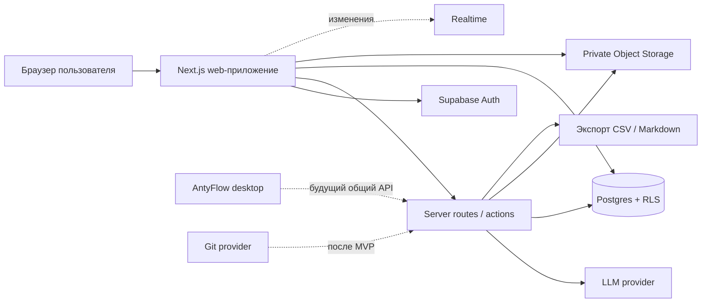

# 03 — Web-first архитектура

> Историческая редакция v1. Актуальное ТЗ: [Plane-first/README](<Plane-first/README.md>).

## Целевая схема MVP



## Технологический выбор

- **Next.js + TypeScript** — единый web-контур интерфейса и server-side операций.
- **Supabase Auth** — регистрация и сессии.
- **Supabase Postgres** — основная БД.
- **Row Level Security** — защита строк по пространству и членству в команде.
- **Supabase Storage** — приватные файлы проектов.
- **Supabase Realtime** — только после устойчивого CRUD; не блокирует первый релиз.
- **Vercel** — быстрый публичный preview/production deploy.
- **Zod** — runtime-валидация входных данных и агентных структур.

## Что переиспользуется из AntyFlow

| Часть AntyFlow | Решение для PPM |
|---|---|
| React-компоненты и визуальный язык | переносить точечно после отделения от Electron API |
| tldraw-холст | отложить; MVP начинается с обычной Kanban-доски |
| Zod и миграционный подход | переиспользовать как правило для контрактов |
| AgentRun, trace, approval | адаптировать к серверной БД |
| Markdown/doc UI | адаптировать к web и проектным правам |
| `better-sqlite3`, Electron main, IPC | не переносить в web-backend |
| локальные sidecar-агенты | не запускать на сервере MVP |
| PDF-RAG и embeddings | отдельный этап после устойчивого хранения документов |

## Почему Postgres, а не SQLite

SQLite остаётся полезным для локального AntyFlow, но PPM требует одновременной работы пользователей, серверной авторизации и изоляции команд. В web-контуре источником истины становится Postgres. Локальный SQLite может позже служить offline-кэшем desktop-клиента.

## Границы модулей

```text
app/
  auth/             регистрация и вход
  workspace/        пространство и команды
  projects/         проекты и обзор
  boards/           Kanban и тикеты
  docs/             Markdown-документы
  files/            загрузка и скачивание
  agents/           запуск, preview, approve/reject
  exports/          CSV и Markdown
packages/
  contracts/        Zod-схемы и типы без UI/runtime зависимостей
  ui/               переиспользуемые web-компоненты
supabase/
  migrations/       DDL, индексы, RLS и seed
  tests/            allow/deny проверки политик
```

## Правила безопасности

1. У каждой проектной строки есть `workspace_id`; у командных данных — ещё `team_id`.
2. RLS включается на каждой таблице, доступной web-клиенту.
3. `service_role` и ключи LLM никогда не попадают в браузер.
4. Storage bucket приватный; скачивание через проверенный signed URL.
5. Агент читает данные в контексте пользователя и не обходит RLS.
6. Запись агента сначала создаёт `draft`, затем требует approve.
7. Никаких персональных данных в prompt/log сверх необходимого проектного контекста.

## Надёжность MVP

- миграции БД хранятся в репозитории;
- все timestamps — UTC;
- IDs — UUID;
- удаления заменяются архивированием там, где это возможно;
- write-операции критических сущностей создают activity event;
- drag-and-drop выполняет один атомарный update статуса и позиции;
- ошибка агента не блокирует ручную работу с проектом.

## Путь после MVP

1. Выделить общий `packages/contracts` для web и desktop.
2. Подключить AntyFlow как визуальный клиент того же Project API.
3. Добавить поиск и связи документов.
4. Добавить cycles/modules и portfolio dashboard.
5. Подключить Git provider через webhook/API.
