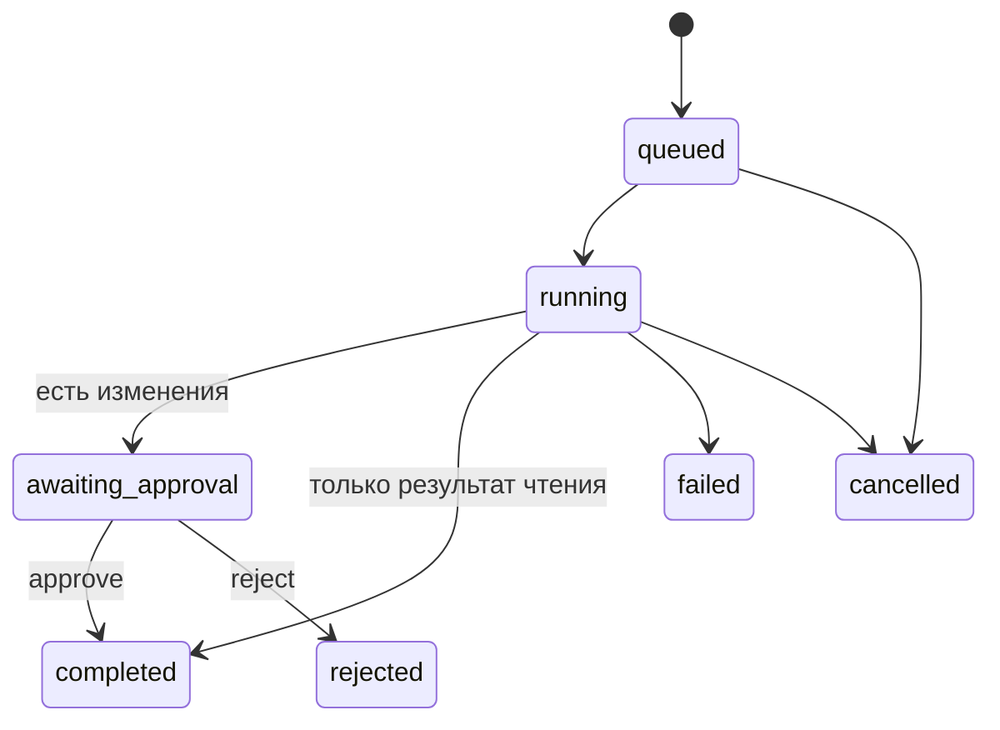

# 05 — Агенты и автоматизации

> Историческая редакция v1. Актуальное ТЗ: [Plane-first/README](<Plane-first/README.md>).

## Принцип

Агент в PPM — не свободный бот, а типизированная операция над доступным проектным контекстом. Он создаёт черновик, показывает использованные источники и не применяет массовые изменения без подтверждения.

## Агенты MVP

### 1. Project Reporter

Вход:

- активные тикеты;
- завершённые тикеты за выбранный период;
- блокировки и просрочки;
- выбранные документы проекта.

Выход:

- Markdown-сводка;
- прогресс;
- риски;
- следующие действия;
- ссылки на тикеты-источники.

### 2. Ticket Decomposer

Вход:

- один тикет;
- выбранный документ требований;
- ограничение на число подзадач.

Выход:

- 3–10 черновиков подзадач;
- критерии приёмки;
- зависимости;
- оценка неопределённости.

Создание реальных тикетов выполняется только после approve руководителем.

### 3. Project Librarian — если остаётся время

Вход: документы и список файлов проекта.

Выход: черновик индекса знаний с краткими аннотациями и потерянными/непривязанными материалами.

## Будущие агенты

- Portfolio Reviewer — сводка по всем командам;
- Risk Reviewer — поиск блокировок и конфликтов сроков;
- Meeting Processor — протокол → тикеты и решения;
- Git Reviewer — commit/PR → связь с тикетом;
- Knowledge Curator — backlinks, дубликаты и архивирование;
- Release Agent — release notes по завершённым work items.

## Разрешённые инструменты MVP

| Инструмент | Чтение | Запись | Подтверждение |
|---|---:|---:|---:|
| `list_project_tickets` | да | нет | нет |
| `read_project_document` | да | нет | нет |
| `list_project_files` | metadata | нет | нет |
| `draft_project_report` | да | draft | нет |
| `draft_subtasks` | да | draft | нет |
| `create_document_from_draft` | да | да | да |
| `create_tickets_from_draft` | да | да | да |

## Жизненный цикл AgentRun



## Контекст и защита данных

- Контекст всегда ограничен `workspace_id + project_id`.
- Агент наследует доступ инициатора.
- В prompt не отправляются ключи, email, служебные роли и signed URLs.
- Файлы не передаются модели автоматически; сначала извлекается разрешённый текст.
- В output сохраняется модель, время, статус, ссылки на источники и расход токенов, если доступен.
- Ошибка LLM не меняет тикеты или документы.

## Контракты

```ts
type AgentKind = 'project_reporter' | 'ticket_decomposer' | 'project_librarian'

type AgentRunResult = {
  runId: string
  status: 'awaiting_approval' | 'completed' | 'failed'
  markdown: string
  sources: Array<{ type: 'ticket' | 'document'; id: string; title: string }>
  proposedActions: Array<{
    actionId: string
    kind: 'create_ticket' | 'create_document'
    payload: unknown
  }>
}
```

Нормативная реализация должна заменить `unknown` точными Zod-схемами до подключения реальных write-действий.

## Критерии MVP

- агент не видит данные другой команды;
- output можно проверить до сохранения;
- повторный approve не создаёт дубликаты;
- источники результата кликабельны;
- ошибки и отмена имеют понятный статус;
- ручная работа PPM полностью доступна без настроенного LLM.
