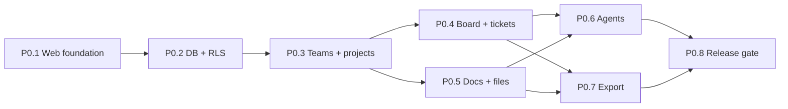

# 06 — План реализации на два дня

> Историческая редакция v1. Актуальный план: [Plane-first/05 — План реализации Plane-first](<Plane-first/05 — План реализации Plane-first.md>).

## Цель срока

К вечеру 2026-09-13 получить опубликованный demo MVP, на котором можно зарегистрироваться, создать команду и проект, вести тикеты, хранить документ и файл, получить AI-сводку и выгрузить данные.

## Критический путь

## День 1 — 2026-09-12: рабочее ядро

### Блок 1. Основание и публикация preview — 1 час

- web-приложение;
- переменные окружения;
- preview deploy;
- health page;
- минимальная навигация.

Результат: существует публичный URL, даже если функции ещё пусты.

### Блок 2. Auth, БД и RLS — 2 часа

- регистрация/вход;
- миграции identity/workspace/team/project;
- memberships;
- RLS allow/deny;
- demo seed.

Результат: два пользователя из разных команд не видят данные друг друга.

### Блок 3. Команды и проекты — 1,5 часа

- список команд;
- состав команды;
- создание проекта;
- карточка проекта;
- стандартные колонки доски.

### Блок 4. Доска и тикеты — 3 часа

- создание и редактирование тикета;
- assignee, priority, due date;
- drag-and-drop по колонкам;
- сохранение позиции;
- фильтр по статусу/участнику — при наличии времени.

### Gate конца дня 1

Обязательный сценарий проходит без ручного вмешательства в БД:

`login → команда → проект → тикет → перемещение → reload → данные сохранены`.

Если gate не пройден, на день 2 не добавляются AI и realtime до восстановления ядра.

## День 2 — 2026-09-13: знания, агенты и выпуск

### Блок 5. Документы и файлы — 2 часа

- список документов;
- Markdown editor/preview;
- привязка документа к тикету;
- приватная загрузка и скачивание файла;
- ограничения типа и размера.

### Блок 6. Агенты — 2 часа

- Project Reporter;
- Ticket Decomposer;
- preview результата;
- approve/reject;
- `agent_runs` и `agent_actions`.

Если LLM не настроена, UI показывает мягкую деградацию и ручные функции продолжают работать.

### Блок 7. Экспорт и обзор — 1 час

- CSV тикетов;
- Markdown-сводка проекта;
- простые counters `готово / в работе / блокировано`.

### Блок 8. QA, безопасность и production deploy — 2 часа

- эталонный сценарий;
- RLS negative tests;
- проверка reload и двух аккаунтов;
- проверка upload/download;
- mobile-width smoke;
- production deploy;
- известные ограничения на странице релиза.

### Резерв — 1 час

Используется только на блокеры критического пути. Не расходуется на Git, сложный дизайн, rich text или новые типы агентов.

## Порядок сокращения scope

Если срок начинает срываться, функции убираются в таком порядке:

1. Realtime.
2. Комментарии.
3. Project Librarian.
4. Фильтры и дополнительные виды доски.
5. Приглашения по email — заменить ручным добавлением существующего пользователя.
6. Drag-and-drop — временно заменить выбором статуса.

Нельзя убирать:

- auth;
- изоляцию команд;
- персистентность тикетов;
- документ или файл;
- один экспорт;
- публичный deploy;
- честную маркировку ограничений.

## Правила остановки

Остановить расширение scope и запросить решение владельца, если:

- требуется перенос всех Electron-нод;
- нужны реальные персональные или секретные данные до проверки RLS;
- требуется собственный Git-хостинг;
- выбранная платформа требует оплаты или публикации приватных материалов;
- для agent write предлагается обход approve;
- к середине 2026-09-13 не проходит gate конца дня 1.
