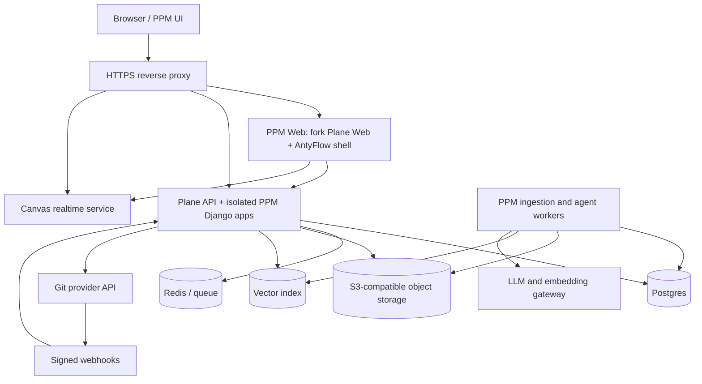

# 04 — Системная архитектура

## Контекст

PPM — многопользовательское web-приложение. Desktop AntyFlow является источником готовых идей и частей UI, но Electron main, прямой доступ к локальному диску, Node IPC, `better-sqlite3`, webview и локальные sidecars нельзя напрямую включать в browser/server bundle.

## Контейнерная схема



## Логические слои

### 1. PPM Web

Основан на fork `makeplane/plane` версии `v1.4.2` и содержит:

- штатные функциональные маршруты Plane;
- AntyFlow design tokens и компоненты;
- собственную глобальную/project navigation;
- русский язык по умолчанию;
- Canvas route;
- Knowledge/Vault UI;
- Project Brain query UI;
- Code/Git UI;
- legal/source page.

### 2. Plane Core

Без дублирования предоставляет:

- auth/session;
- workspace и memberships;
- projects и project roles;
- Work Items, states, labels, assignees;
- cycles, modules, views;
- Pages, attachments, comments и activity;
- background jobs и базовые webhooks.

PPM не изменяет существующие таблицы Plane напрямую, если задачу можно решить отдельной PPM-моделью и внешним ключом UUID.

### 3. PPM Extension API

Изолированные Django apps, регистрируемые рядом с Plane API:

```text
plane/ppm/
├── common/        permissions, errors, idempotency, audit
├── canvas/        snapshots, bindings, semantic edges
├── vault/         folders, files, versions, links
├── knowledge/     sources, chunks, indexing, retrieval
├── agents/        runs, actions, approvals, citations
└── git/           connections, repositories, events, links
```

Точный путь может быть адаптирован под структуру fork, но модули не смешиваются в один файл и не помещают PPM-поля в core-модели Plane без отдельного решения.

### 4. Canvas Web

Browser-safe порт AntyFlow/tldraw:

- tldraw editor;
- PPM node registry;
- проекции Plane/Vault/Git;
- семантические связи;
- autosave/version conflict;
- query/agent nodes;
- realtime после базового snapshot режима.

### 5. Project Vault

Серверное файловое пространство проекта:

- metadata и дерево — Postgres;
- содержимое файлов — object storage;
- Markdown редактируется в web UI;
- версии неизменяемы;
- wiki-links и backlinks индексируются;
- экспорт ZIP сохраняет структуру папок.

### 6. Project Brain

Pipeline знаний:

```text
Source changed
→ ingestion job
→ extract
→ normalize
→ chunk
→ keyword index + embedding
→ graph bindings
→ ready for retrieval
```

Каждый поиск обязательно фильтруется по разрешённым `workspace_id + project_id` до передачи текста модели.

### 7. LLM gateway

Единый server-side интерфейс:

```ts
interface ModelGateway {
  embed(input: EmbedRequest): Promise<EmbedResult>
  complete(input: CompletionRequest): Promise<CompletionResult>
  stream(input: CompletionRequest): AsyncIterable<ModelChunk>
}
```

Поддерживаются OpenAI-compatible endpoints. Конкретный provider и модель задаются instance/workspace policy. Browser не получает provider secret.

При отсутствии embeddings система использует keyword retrieval. При отсутствии LLM все не-AI функции продолжают работать.

### 8. Git adapter

Провайдер-независимый контракт:

```ts
interface GitProvider {
  listRepositories(projectContext): Promise<Repository[]>
  listBranches(repositoryId): Promise<Branch[]>
  listCommits(repositoryId, cursor?): Promise<Page<Commit>>
  getPullRequest(repositoryId, number): Promise<PullRequest>
  createBranch(input): Promise<Branch>
  createPullRequest(input): Promise<PullRequest>
  verifyWebhook(headers, rawBody): VerifiedGitEvent
}
```

Первый adapter выбирается отдельной задачей G1. Архитектура не должна зашивать GitHub-специфичные поля в общие PPM-таблицы.

## Развёртывание по домену

Рекомендуемый routing:

```text
https://ppm.example.org/                 PPM Web
https://ppm.example.org/api/             Plane + PPM API
https://ppm.example.org/live/            realtime/collaboration
https://ppm.example.org/files/           signed download gateway
https://ppm.example.org/source            AGPL/source notices
```

Git provider может работать на отдельном домене `git.example.org`. В PPM он отображается через API, а clone URLs остаются стандартными.

## Репозитории исходного кода

Целевая форма:

```text
PPM workspace
├── antyflow/                         исходная desktop-ветка и переносимые модули
├── plane-fork/                       fork Plane v1.4.2 + PPM patches
│   ├── apps/web/
│   ├── apps/api/
│   ├── packages/ppm-brand/
│   └── packages/ppm-canvas/
├── services/
│   ├── ppm-ingestion-worker/
│   └── ppm-model-gateway/             если не внутри API worker
├── infra/
│   ├── compose/
│   ├── proxy/
│   └── backup/
└── docs/
```

Если точное monorepo-размещение выбирается в I0.1. Нормативно сохраняется история upstream и маленькие тематические PPM-коммиты.

## Интеграционные правила

1. Все browser-запросы идут same-origin.
2. Сессия Plane используется PPM API; отдельный JWT в localStorage не вводится.
3. Project permission проверяется в каждом PPM endpoint.
4. Долгие extraction/embedding/agent операции выполняются worker-ом.
5. Object storage URLs короткоживущие и не попадают в prompts/logs.
6. Git webhooks проверяют подпись до разбора события.
7. Индексация и webhooks идемпотентны.
8. Любой derived cache имеет source version/hash.

## Архитектурные запреты

- импорт Electron `fs`, `ipcRenderer`, `BrowserWindow` в web;
- прямой доступ browser к Postgres/object storage/provider tokens;
- использование Canvas snapshot как базы Work Items;
- запись RAG-ответа обратно в источник без approval;
- запуск произвольных Git-команд в основном API container;
- автоподтягивание `latest` Plane;
- зависимость ручной работы от доступности AI provider.
