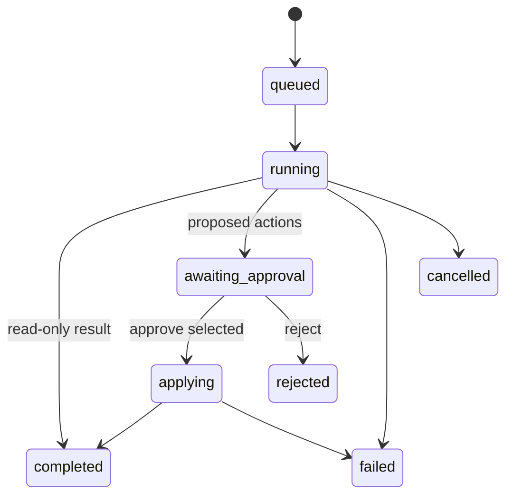

# 12 — Агенты, инструменты и подтверждения

## Принцип

Агент — типизированная операция над разрешённым project context. Он не получает произвольный доступ к базе, filesystem, Git shell или provider token.

## Режимы

### Read-only

Анализирует и отвечает. Подтверждение не требуется, но все источники доступны пользователю.

### Propose

Создаёт `ppm_agent_actions` со строгими payload и preview. Ничего не применяет.

### Apply approved

После approve повторно проверяет права, версии и условия, затем применяет только allowlisted action.

## Агенты первого полезного релиза

### Project Q&A

Отвечает по выбранным нодам или всему проекту. Не имеет write tools.

### Project Reporter

Готовит сводку: прогресс, завершённое, блокировки, просрочки, риски, решения и следующие шаги. Выход — Markdown draft с citations.

### Work Decomposer

Вход: цель/Work Item + выбранные требования. Выход: 3–10 предложений Work Items с acceptance criteria, dependencies и uncertainty.

### Knowledge Librarian

Находит orphan files, broken wiki-links, похожие документы, устаревшие summaries и материалы без связей. Rename/move/merge только через proposals.

### Relationship Analyst

Предлагает typed semantic edges на Canvas. До approve рёбра визуально отличаются и не считаются подтверждёнными.

### Git Reviewer — после G1

Сопоставляет PR с требованиями и Work Items, формирует draft review. Не публикует комментарии и не merge без отдельного подтверждения.

## Allowlisted tools

| Tool | Read | Write | Approval |
|---|---:|---:|---:|
| `search_project_knowledge` | да | нет | нет |
| `read_source_fragment` | да | нет | нет |
| `list_work_items` | да | нет | нет |
| `read_work_item` | да | нет | нет |
| `read_canvas_neighborhood` | да | нет | нет |
| `read_vault_file` | да | нет | нет |
| `read_git_metadata` | да | нет | нет |
| `propose_work_items` | да | proposal | нет |
| `propose_semantic_edges` | да | proposal | нет |
| `propose_page_or_vault_note` | да | proposal | нет |
| `create_work_items_from_action` | да | да | обязательно |
| `apply_semantic_edges` | да | да | обязательно |
| `write_vault_file_from_action` | да | да | обязательно |
| `create_git_branch_from_action` | да | да | обязательно |
| `create_pull_request_from_action` | да | да | обязательно |
| `merge_pull_request` | нет в базовой версии | нет | отдельное решение |

## Контекст агента

```ts
type AgentContextV1 = {
  schema_version: 1
  actor_id: string
  workspace_id: string
  project_id: string
  canvas_id?: string
  selected_shape_ids?: string[]
  thread_id?: string
  locale: 'ru' | 'en'
  capabilities: string[]
  retrieval_policy_id: string
}
```

Context создаётся сервером. Browser не может добавить capability или заменить project ID.

## Жизненный цикл



## Preview действия

Пользователь видит:

- что будет создано/изменено;
- старое и новое значение;
- источник предложения;
- права, с которыми будет выполнено действие;
- предупреждение о конфликте версии;
- выбор отдельных действий.

Batch approve не скрывает отдельные элементы.

## Идемпотентность и preconditions

- action имеет unique `idempotency_key`;
- approve сохраняет `approved_by` и timestamp;
- перед apply загружается canonical entity;
- если `updated_at/SHA/version` изменился, действие не применяется автоматически;
- повторный apply возвращает ранее созданный object reference;
- partial batch сообщает успех/ошибку каждого элемента.

## Prompt/tool injection

Текст из Vault, Pages, Work Items, Canvas и code рассматривается как данные. Любая инструкция внутри источника не изменяет system policy и tool allowlist. Agent получает разделённые blocks `policy`, `user request`, `retrieved sources`.

## Аудит

Для run сохраняются:

- инициатор;
- project scope;
- model/embedding profiles;
- retrieval source IDs/versions;
- prompt template version и input hash;
- status/latency/token usage при наличии;
- proposed/applied actions;
- безопасная ошибка.

Полные secrets и signed URLs не сохраняются. Полное содержимое пользовательского prompt хранится согласно workspace retention policy.

## Acceptance

1. Read-only run не создаёт mutations.
2. Proposal не меняет source до approve.
3. Approve пользователя без права отклоняется.
4. Изменённый после preview source вызывает conflict.
5. Повторный approve не создаёт дубликат.
6. Ответ имеет citations или явно сообщает об отсутствии оснований.
7. Prompt injection fixture не вызывает запрещённый tool.
8. Отключённая модель не блокирует ручную работу.
