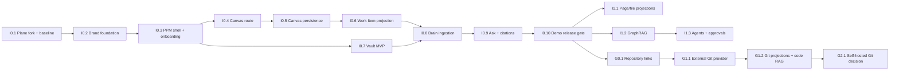

# 15 — План реализации и релизы

## Принцип планирования

Двухдневный срок относится к демонстрационному вертикальному срезу, а не ко всей платформе. Полная визуальная замена всех экранов, production RAG, Obsidian-like Vault и Git hosting разбиты на независимые gates.

## Карта этапов



## Release D0 — двухдневная демонстрация

### Цель

Доказать идентичность продукта и главный сквозной сценарий, не имитируя production readiness.

### Обязательный результат

- чистый Plane baseline запускается;
- пользователь видит PPM name/logo/colors и русскую оболочку;
- project navigation содержит `Мозг проекта`;
- Canvas сохраняет заметки и Work Item projections;
- минимальный Vault создаёт/читает Markdown и загружает PDF;
- Project Brain индексирует Work Item, Markdown и PDF text layer;
- пользователь задаёт вопрос и получает ответ с citations;
- всё работает с одной Plane session;
- два проекта не смешиваются;
- известные ограничения показаны.

### Честные ограничения D0

- не все экраны Plane полностью перерисованы;
- Canvas realtime может быть выключен;
- Vault поддерживает ограниченный набор типов;
- RAG рассчитан на демонстрационный объём;
- write agents выключены;
- Git ограничен ссылкой на repository либо mock/ручной link;
- production backup, SSO и hardening не заявляются готовыми без фактической проверки.

## День 1

### Блок A — baseline

1. Fork/pin Plane `v1.4.2`.
2. Сохранить upstream и legal provenance.
3. Поднять clean stack.
4. Пройти register → workspace → project → Work Item → Page → restart.

### Блок B — визуальная идентичность

1. Добавить `ppm-brand` tokens.
2. Подключить палитру Графит/Светлая.
3. Заменить app name, logo, favicon и основные meta.
4. Переработать auth/onboarding и navigation shell.
5. Сделать legal/source page.

### Gate дня 1

Пользователь регистрируется и выполняет базовую работу, не встречая Plane branding на основном пути. Чистый baseline остаётся воспроизводимым отдельным commit/ref.

## День 2

### Блок C — Canvas

1. Добавить project route `Мозг проекта`.
2. Перенести browser-safe tldraw core.
3. Реализовать note и work_item_ref.
4. Сохранить versioned snapshot.
5. Проверить права двух пользователей/двух проектов.

### Блок D — Vault и Brain

1. Создать Vault root и минимальное tree API.
2. Реализовать Markdown create/read/write и PDF upload.
3. Добавить index policy.
4. Проиндексировать Work Item, Markdown и PDF text.
5. Выполнить hybrid либо keyword+dense retrieval по доступной конфигурации.
6. Вывести answer node с citations.

### Gate дня 2

Сценарий:

```text
register
→ project
→ Work Item
→ Vault Markdown/PDF
→ Canvas projections
→ connect nodes
→ ask project
→ answer with citations
→ reload
```

проходит на двух тестовых проектах без утечки.

## Release 0.1 — устойчивое ядро

- завершить B3/B4 visual surfaces;
- Page/Vault/file projections;
- Vault versions/trash/export/backlinks;
- автоматическое обновление индекса;
- RAG evaluation suite;
- realtime Canvas с project authorization;
- backup/restore;
- observability;
- security negative matrix;
- публичный demo deployment.

## Release 0.2 — интеллект и Git connection

- GraphRAG;
- Project Reporter/Decomposer/Librarian;
- action preview/approval;
- external Git provider adapter;
- commits/PR links;
- Canvas Git projections;
- opt-in README/code indexing;
- external knowledge connectors.

## Release 0.3 — self-hosted development platform

- ADR выбора Forgejo/альтернативы;
- bundled provider deployment;
- SSO;
- repository provisioning from project;
- backups/LFS;
- PPM code UI;
- optional CI/status integration;
- release notes agent.

## Приоритет при нехватке времени

1. auth/permissions/data safety;
2. clean Plane baseline;
3. PPM visual identity first path;
4. Canvas persistence;
5. Work Item projection;
6. Vault Markdown;
7. RAG citations;
8. PDF;
9. polish;
10. Git automation.

Нельзя жертвовать tenant isolation и source integrity ради дополнительной ноды или анимации.

## Stop rules

Остановить расширение scope и сообщить владельцу, если:

- Plane baseline не запущен;
- auth Canvas/Vault обходится прямым URL;
- для ребрендинга требуется массово переписать бизнес-логику;
- RAG filter нельзя доказать тестом;
- файл теряется/перезаписывается при ошибке индекса;
- AGPL source offer отсутствует;
- Git integration требует хранения пользовательского private SSH key;
- текущая карточка затрагивает области следующей фазы без решения.
