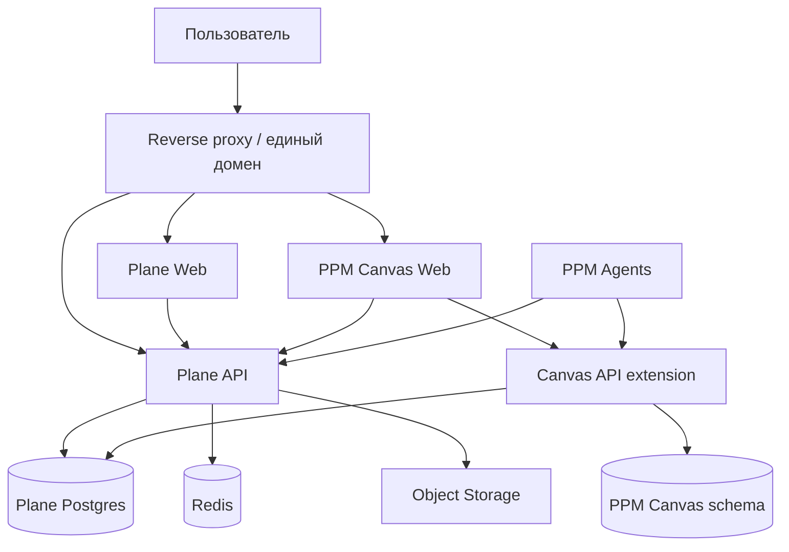

# 02 — Архитектура Plane и AntyFlow

## Общая схема



## Компоненты

### Plane Community

Включается полностью и остаётся основной оболочкой:

- web UI;
- Django API;
- auth;
- background workers;
- Postgres;
- Redis;
- object storage;
- proxy/deployment configuration.

### PPM Canvas Web

Browser-safe слой AntyFlow:

- tldraw;
- минимальный реестр web-совместимых нод;
- загрузка и сохранение snapshot;
- work-item cards;
- переходы в Plane;
- будущие документы/файлы/агенты.

Electron main, Node IPC, `better-sqlite3`, terminal, Jupyter kernel, webview и локальные sidecars не импортируются в server/web bundle.

### Canvas API extension

Минимальный backend-модуль:

- проверяет сессию Plane;
- проверяет membership/permission project;
- создаёт и читает canvas проекта;
- хранит версии snapshot;
- создаёт bindings к сущностям Plane;
- вызывает штатный Plane API/service для work items.

## Интеграция в интерфейс Plane

Предпочтительный вариант — добавить пункт `Холст` в project navigation fork-а Plane. Сам canvas может быть:

1. встроенным React-модулем Plane web; или
2. отдельным same-origin приложением, показанным в интегрированной области.

Для первого релиза выбирается вариант с минимальным изменением upstream. iframe допустим только как временная реализация, если:

- остаётся один домен;
- нет второго логина;
- проверяется project permission;
- отсутствует публичный доступ к canvas URL;
- документирован план замены.

## Репозитории исходного кода

```text
PPM repository
├── src/ и остальной AntyFlow desktop
├── apps/ppm-canvas-web/       browser-safe холст
├── services/ppm-canvas-api/   расширение хранения/bridge
├── vendor/plane/              fork/submodule Plane v1.4.2
├── infra/                     единый compose и proxy
└── docs/ppm/                  исполнимое ТЗ
```

Если fork Plane требует изменения внутри `apps/web` и `apps/api`, эти изменения коммитятся в fork, а PPM repository закрепляет точный commit submodule.

## Единая авторизация

- пользователь входит только через Plane;
- Canvas получает серверно проверенный user/project context;
- Canvas не доверяет `project_id` из URL без проверки membership;
- отдельные Supabase Auth и таблица пользователей не создаются;
- service tokens не передаются в браузер.

## Развёртывание

Рекомендуемый первый контур:

- Linux VM;
- Docker Compose;
- закреплённые container/source versions;
- внешний Postgres и object storage для production после demo;
- HTTPS reverse proxy;
- один домен PPM.

Локальный Windows-компьютер используется для разработки; production Plane запускается в поддерживаемом Linux/Docker окружении.

## Правило обновления

Upstream Plane никогда не обновляется плавающим `latest`. Обновление выполняется отдельной карточкой:

`fetch upstream → compare changelog/security → test fork patches → migrate copy DB → smoke → release`.
