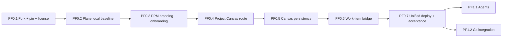

# 05 — План реализации Plane-first

## Изменение приоритета

Сначала запускается и принимается Plane Community. Только после этого в Plane project добавляется холст. Собственные тикеты, auth, документы и файловое хранилище PPM больше не разрабатываются — используются штатные возможности Plane.

## Критический путь



## День 1 — Plane как работающий продукт

### PF0.1 — источник и лицензия

- fork Plane;
- pin `v1.4.2`;
- подключение полного source tree;
- license inventory;
- upstream remote и update policy.

### PF0.2 — baseline Plane

- поддерживаемый Docker/Linux runtime;
- штатный запуск Plane;
- регистрация;
- workspace;
- project;
- work item;
- page и attachment;
- фиксация ресурсов и известных ограничений.

### PF0.3 — минимальный PPM-слой

- название/логотип/цвета без удаления legal notices;
- стартовый onboarding проектной школы;
- после регистрации — штатный Plane workspace/projects flow;
- русский язык только там, где это не требует массового форка локализации.

### Gate дня 1

```text
register → workspace → project → work item → page → reload
```

проходит на немодифицированном функциональном ядре Plane.

## День 2 — холст внутри project

### PF0.4 — маршрут «Холст»

- пункт в project navigation;
- browser-safe Canvas shell;
- автоматический project context;
- permission deny для постороннего пользователя.

### PF0.5 — сохранение холста

- один canvas на project;
- create/read/update;
- version/ETag conflict;
- reload без потери нод;
- второй участник project видит тот же snapshot.

### PF0.6 — минимальный bridge

- список work items проекта на холсте;
- создание work item из холста;
- binding shape → work item;
- переход из shape в штатный экран Plane;
- удаление shape не удаляет work item.

### PF0.7 — единая поставка

- единый домен;
- одна регистрация;
- Plane + Canvas через reverse proxy;
- E2E двух аккаунтов;
- AGPL source link;
- rollback plan;
- demo deploy.

## Что переносится после первого релиза

- AI-агенты;
- ноды Pages/attachments/modules/cycles;
- realtime collaboration canvas;
- полный набор AntyFlow web-нод;
- Git provider;
- портфельная панель фонда;
- русский перевод всего Plane;
- hardening production infrastructure.

## Реалистичность двух дней

В два дня можно получить запущенный Plane и доказать вертикальную интеграцию с минимальным project canvas. Полное объединение всех функций AntyFlow, глубокая синхронизация и production-grade эксплуатация требуют следующих этапов. Если PF0.2 не проходит к середине первого дня, работа над canvas не начинается до исправления baseline.

## Stop rules

Остановиться и запросить решение владельца, если:

- стабильный релиз не собирается в доступном окружении;
- требуется использовать commercial-only компонент;
- интеграция требует удалить AGPL notice;
- нет Linux/Docker среды для общего deploy;
- auth Plane невозможно безопасно переиспользовать для canvas;
- приходится изменять десятки upstream-моделей вместо изолированного extension;
- объём выходит за PF0 и угрожает рабочему Plane baseline.
